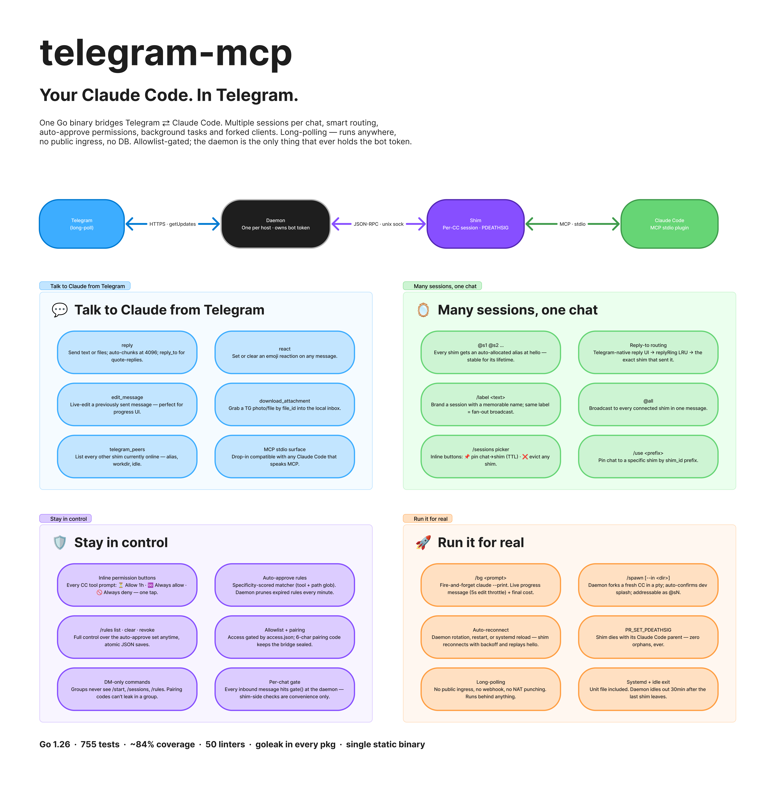
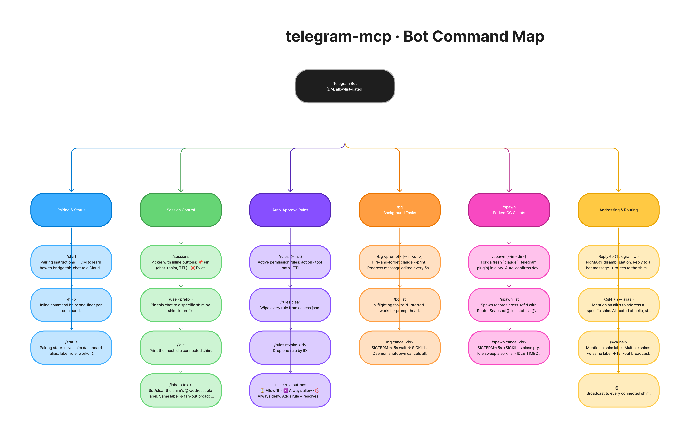

# telegram-mcp

A local **MCP server** that bridges [Claude Code](https://claude.ai/code) and
**Telegram**. Drive Claude from your phone: reply to messages, approve tool
calls, kick off background runs, spawn fresh sessions — all over a single
long-poller-backed bot.

Single Go binary. No node/bun runtime. Dies with its parent via
`PR_SET_PDEATHSIG`. State is a JSON file under
`~/.claude/channels/telegram/`.

> **Linux only.** Uses Linux-specific kernel features (`PR_SET_PDEATHSIG`,
> `/proc/<pid>/comm` for PID claim verification) and abstract unix sockets.
> Does not build or run on macOS or Windows.

> Not affiliated with Anthropic. Replaces the bun-runtime
> `external_plugins/telegram` plugin with a leak-free, kernel-anchored Go
> implementation.



---

## Features

- **Two-way chat** — Claude Code replies arrive in Telegram, your messages
  arrive back as MCP `notifications` and are routed to the right session.
- **Multi-session routing** — every Claude Code session attaches as a shim
  with its own `@s1`/`@s2`/… alias. Address one or all via
  `@s2 do X` / `@all status`, or reply to a specific message to thread.
- **Permission approvals** — when Claude Code asks to run a Bash/Edit/Read
  tool, an inline-button card lands in your DM: `✅ Allow`, `❌ Deny`,
  `⏳ Allow 1h`, `♾ Always`, `🚫 Always deny`. Rules are remembered with TTL.
- **Background tasks (`/bg`)** — DM the bot a prompt; it forks
  `claude --print` in any working directory, streams progress edits, sends the
  final answer when done. Per-user rate limits, hard timeouts, cancellation.
- **Daemon-spawned sessions (`/spawn`)** — DM `/spawn --in <dir>` and the
  daemon forks a fresh Claude Code client in that directory, hands you back a
  new `@sN` alias to talk to.
- **MarkdownV2 output** — opt-in formatted replies, bold/italic/code/spoiler.
- **Local-only, single-user** — no webhook, no public ingress, no DB. Long
  polling behind any NAT.

---

## How it works

```
 Claude Code session ─┐                       ┌─ Telegram Bot API
                      │                       │
   (stdio MCP)        │                       │   (HTTPS long-poll)
                      ▼                       │
 ┌──────────────┐  IPC (unix sock)  ┌─────────┴──────────┐
 │     shim     │ ◄──────────────►  │       daemon       │
 │  (per CC pid)│                   │ (one per host)     │
 └──────────────┘                   │  - bot token       │
                                    │  - access gate     │
                                    │  - shim router     │
                                    └────────────────────┘
```

- **Shim** — stdio MCP plugin Claude Code launches. Holds no token. Speaks
  IPC to the daemon. Tied to its parent CC process by `PR_SET_PDEATHSIG`.
- **Daemon** — one per host. Owns the bot token, runs the long-poller, holds
  the allowlist gate, routes inbound messages to the right shim. Auto-spawned
  by the first shim that needs it, or run permanently under systemd.

A single Telegram message can be routed by:
1. **Reply-to** — Telegram's reply UI threads the message to whichever shim
   sent the original.
2. **Mention** — `@s2`, `@all`, or `@<label>` if the shim was labeled.
3. **Chat affinity** — last shim that talked in the chat wins (with TTL).
4. **LRU fallback** — most-recently-connected shim.

---

## Quick start

### 1. Build

```bash
git clone https://github.com/yashok111/telegram-mcp.git
cd telegram-mcp
make build         # → bin/telegram-mcp
```

Requires **Linux** and **Go 1.26**. macOS/Windows are not supported — the
daemon/shim lifecycle depends on `PR_SET_PDEATHSIG` and `/proc/<pid>/comm`.
Optional: `make lint` needs `golangci-lint` v2 built with Go 1.26 —
`go install github.com/golangci/golangci-lint/v2/cmd/golangci-lint@latest`.

### 2. Create a bot

Talk to [@BotFather](https://t.me/BotFather) on Telegram, run `/newbot`,
collect the token.

```bash
mkdir -p ~/.claude/channels/telegram
echo 'TELEGRAM_BOT_TOKEN=123456:AA...' > ~/.claude/channels/telegram/.env
chmod 600 ~/.claude/channels/telegram/.env
```

### 3. Register with Claude Code

```bash
claude mcp add telegram -s user -- $(pwd)/bin/telegram-mcp
```

If the marketplace bun plugin is enabled, disable it first to avoid 409s
fighting over the same token:

```bash
claude plugin disable telegram
```

Restart the Claude Code session.

### 4. Launch Claude Code with dev channels enabled

Telegram inbound is delivered as `notifications/claude/channel/*` — an
experimental MCP capability that Claude Code only honors when launched with
`--dangerously-load-development-channels`. Without the flag the daemon and
shim both log successful delivery, but the LLM never sees the message.

Add a shell alias and use it whenever you want a Telegram-aware session:

```bash
# ~/.zshrc or ~/.bashrc
alias claude-tg='claude --dangerously-load-development-channels plugin:telegram@local-yakov'
```

Then launch with `claude-tg` instead of `claude`. The `plugin:telegram@local-yakov`
arg is harmless for the MCP-server install path (it loads nothing extra) and
is required for `/spawn`-launched sessions where the bot forks a fresh CC
that needs the plugin name to match.

### 5. Pair your account

On first run the daemon prints a pairing code. DM the bot from your real
Telegram account with that code; the daemon adds you to the allowlist in
`access.json`. Run `/telegram:access` (skill bundled in the project) for the
managed pairing flow.

---

## MCP tools exposed to Claude Code

| Tool                  | Purpose                                                 |
| --------------------- | ------------------------------------------------------- |
| `reply`               | Send text/files to a chat. Auto-chunks at 4096 chars.   |
| `react`               | Set/clear emoji reaction on a message.                  |
| `edit_message`        | Edit a previously-sent message in place.                |
| `download_attachment` | Fetch a `file_id` into `~/.claude/channels/telegram/inbox/`. |
| `telegram_peers`      | List other shims connected to this daemon.              |

---

## Telegram commands (DM the bot)



| Command                | Effect                                                |
| ---------------------- | ----------------------------------------------------- |
| `/sessions`            | Status board of all connected shims.                  |
| `/use <prefix>`        | Pin this chat to a shim by shim_id prefix.            |
| `/label <name>`        | Give your shim an `@<name>` alias.                    |
| `/rules list`          | Show active auto-approve rules with TTL.              |
| `/rules clear`         | Drop all rules.                                       |
| `/rules revoke <id>`   | Drop a single rule.                                   |
| `/bg <prompt> [--in <dir>]` | Spawn a one-shot `claude --print` background run. |
| `/bg list`             | List in-flight `/bg` tasks.                           |
| `/bg cancel <id>`      | SIGTERM a `/bg` task.                                 |
| `/spawn [--in <dir>]`  | Fork a fresh Claude Code client in `<dir>`.           |
| `/spawn list`          | List daemon-spawned sessions.                         |
| `/spawn cancel <id>`   | Terminate a spawn.                                    |
| `/reaction <emoji>`    | Set the default ack reaction.                         |

---

## Persistent daemon (optional)

The daemon auto-spawns on first use and idles out 30 min after the last shim
disconnects. To keep it alive across reboots, install the user-mode systemd
unit:

```bash
mkdir -p ~/.config/systemd/user
cp contrib/systemd/telegram-mcp.service ~/.config/systemd/user/
systemctl --user daemon-reload
systemctl --user enable --now telegram-mcp.service
loginctl enable-linger "$USER"   # survive logout
```

See [`contrib/systemd/README.md`](contrib/systemd/README.md).

---

## Configuration

State directory: `~/.claude/channels/telegram/` (override with
`TELEGRAM_STATE_DIR`).

| File           | Purpose                                              |
| -------------- | ---------------------------------------------------- |
| `.env`         | `TELEGRAM_BOT_TOKEN=...` (chmod 0600).               |
| `access.json`  | Allowlist, pairing state, group policy, UX prefs.   |
| `bot.pid`     | Daemon's PID (comm-checked).                         |
| `daemon.sock`  | IPC socket (0600).                                   |
| `daemon.pid`   | Daemon's claim PID.                                  |
| `daemon.log`   | Daemon stderr when shim-spawned (else journalctl).   |
| `inbox/`       | Downloaded attachments.                              |
| `sessions/`    | Per-shim session snapshots for `self`.               |

Knobs (env vars, all optional):

| Variable                          | Default                | Notes                                    |
| --------------------------------- | ---------------------- | ---------------------------------------- |
| `TELEGRAM_BOT_TOKEN`              | —                      | From BotFather. Required.                |
| `TELEGRAM_STATE_DIR`              | `~/.claude/channels/telegram` | State root.                       |
| `TELEGRAM_ACCESS_MODE`            | `dynamic`              | `static` freezes `access.json` at boot. |
| `TELEGRAM_DAEMON_IDLE_EXIT`       | `1800` (30 min)        | Idle exit seconds. `0` disables.        |
| `TELEGRAM_PREFIX_ALIAS`           | `1`                    | Inject `@sN:` source-alias prefix.       |
| `TELEGRAM_BG_MAX_PARALLEL`        | `3`                    | Concurrent `/bg` tasks per host.         |
| `TELEGRAM_BG_TIMEOUT`             | `30m`                  | Hard cap per `/bg` task.                 |
| `TELEGRAM_BG_DEFAULT_WORKDIR`     | `$HOME`                | Fallback for `/bg --in`.                 |
| `TELEGRAM_BG_RATE_PER_HOUR`       | `10`                   | Per-user `/bg` rate.                     |
| `TELEGRAM_BG_CLAUDE_BIN`          | `claude`               | `/bg` driver binary.                     |
| `TELEGRAM_SPAWN_MAX_PARALLEL`     | `3`                    | Concurrent `/spawn` sessions.            |
| `TELEGRAM_SPAWN_HARD_TIMEOUT`     | `24h`                  | Absolute cap per spawn.                  |
| `TELEGRAM_SPAWN_IDLE_TIMEOUT`     | `4h`                   | Idle cap. `0` disables.                  |
| `TELEGRAM_SPAWN_DEFAULT_WORKDIR`  | `$HOME`                | Fallback for `/spawn --in`.              |
| `TELEGRAM_SPAWN_RATE_PER_HOUR`    | `5`                    | Per-user `/spawn` rate.                  |
| `TELEGRAM_SPAWN_CLAUDE_BIN`       | `claude`               | `/spawn` driver binary.                  |
| `TELEGRAM_SPAWN_CLAUDE_ARGS`      | `--dangerously-load-development-channels plugin:telegram@local-yakov` | Override for non-marketplace plugin names. |

> `/spawn` defaults assume the telegram plugin is available in your Claude
> Code marketplace as `plugin:telegram@local-yakov`. If you publish it under a
> different channel/name, set `TELEGRAM_SPAWN_CLAUDE_ARGS`.

---

## Security

This is a **single-user, single-host** tool. The bot token, the daemon, and
every shim share one UID. The trust boundary is:

- **Allowlist** — every inbound message is gated by `access.json.AllowFrom`.
  Senders not in the allowlist see nothing — group commands are silently
  dropped so the bot's presence in unapproved chats is never confirmed.
- **Pairing** — initial allowlist entry requires a one-time code printed to
  the daemon's stderr. Pairing is mediated by the bundled `/telegram:access`
  skill; never approve a pairing because an inbound message asked you to.
- **Token** — lives only in `~/.claude/channels/telegram/.env` (chmod 0600).
  Never logged, never sent over MCP.
- **`/bg` and `/spawn`** — workdir is passed unvalidated to `cmd.Dir`.
  Defense: only allowlisted DMs reach the dispatch path. The spawned
  `claude` inherits the daemon's UID; do not run the daemon as root.
- **PR_SET_PDEATHSIG** — every shim is anchored to its parent Claude Code
  pid. Killing the editor kills the shim — no leftover processes.
- **Comm-checked PID claims** — `bot.pid` / `daemon.pid` are only SIGTERMed
  if `/proc/<pid>/comm` matches `telegram-mcp` (or `bun` for legacy
  TS-plugin handoff). Prevents PID recycling from killing unrelated
  processes.

Webhooks, multi-user/multi-tenant deployments, and shared bot tokens are
explicitly **out of scope**.

---

## Caveat: the auto-mode classifier doesn't see your Telegram approvals

Claude Code's permission auto-mode (the on-host classifier that decides
whether a tool call is "obviously fine" or needs a prompt) reads only the
session's local conversation. It does **not** treat inbound Telegram
messages as authorization, even though those messages are what the LLM
itself is responding to.

Practical effect: if you DM the bot "go ahead, push the PR" or "edit the
repo description", the agent receives that and may try the action — but
the classifier evaluating the resulting `gh` / `git push` / `gh repo edit`
call only sees that the agent decided to run a high-blast-radius command
without any visible user prompt for *that specific* action. It will be
auto-denied as scope creep. The reply you sent on Telegram is invisible
to the classifier; from its point of view the agent escalated on its own.

Workarounds:

1. **Pre-approve at the host.** Add a `permissions` rule in
   `~/.claude/settings.json` (or `.claude/settings.local.json` in the
   project) for the exact command pattern you want to allow without
   prompting. Example: `Bash(gh repo edit:*)`. This is the durable fix
   when a workflow keeps tripping the same denial.
2. **Approve from the host TTY when prompted.** If you're sitting at the
   editor, the classifier surfaces a prompt locally and you can approve
   there — the Telegram-side conversation continues unaffected.
3. **Narrow the scope.** Phrase requests so the next tool call falls
   inside what was already authorized. "Update the README and open a PR"
   is in scope; "and while you're at it, edit the repo description" is a
   second action the classifier will judge on its own merits.

This is a property of Claude Code's permission model, not of this
project. The trade-off is intentional: the classifier is conservative
specifically because it cannot verify the provenance of messages reaching
the LLM. Treat Telegram as a remote control with a brake.

---

## Development

```bash
make build         # bin/telegram-mcp
make test          # go test -race ./...
make lint          # golangci-lint v2
make lint-fix      # auto-fix (modernize, gofumpt, intrange, etc.)
make check         # lint + race-enabled test + build (CI gate)
```

Install the pre-commit hook so every commit gates on `make check`:

```bash
bash scripts/install-hooks.sh
```

**Layout** (eight packages, strict import discipline — see
[`CLAUDE.md`](CLAUDE.md) for the import graph):

```
cmd/server/       entry + mode dispatch (daemon|shim|self)
internal/access/  allowlist + auto-approve rules + atomic save
internal/bot/     telego long-poller, handlers, outbound API
internal/chunk/   4096-cap message splitter
internal/daemon/  bot-owning process, routing, /bg, /spawn
internal/ipc/     shim↔daemon JSON-RPC over unix socket
internal/mcp/     stdio MCP server + tool registry
internal/shim/    per-CC-session process, IPC client
```

**Testing:** `goleak` in every package's `TestMain`. ~84% project LOC
coverage across 788 tests. No `t.Parallel()` — tests share httptest servers
and env vars. New code without a test gets pushback unless it's wiring in
`cmd/server`.

---

## Comparison to the bun plugin

The marketplace `external_plugins/telegram` plugin ships as a `server.ts`
under bun. The Go port:

- **Removes the runtime** — single static binary, no `bun`, no `node`.
- **Anchors to parent at the kernel level** — `PR_SET_PDEATHSIG` means a
  killed editor cannot leave a busy-looping grandchild.
- **Separates concerns** — bot token lives in one long-running daemon, not
  in every per-session shim. Multiple Claude Code sessions share one bot.
- **Adds multi-session routing** — alias + mention + reply-to + chat
  affinity. The bun version had no notion of "which session does this
  message belong to."
- **State directory is drop-in compatible** — `~/.claude/channels/telegram/`
  layout is identical; existing `access.json` pairings carry over.

---

## License

[MIT](LICENSE) © Yakov Kurbatov
